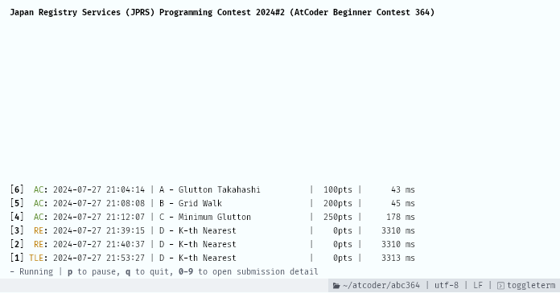

# atcoder-judge-monitor / AtCoder提出モニター

**[English](./README.md)** | 日本語

  
これはAtCoderの提出状況をリアルタイムで表示するシンプルなモニターです。
[`oj s main.rb`](https://github.com/online-judge-tools/oj) などと組み合わせて使うことで、提出からジャッジ確認をブラウザ無しで行うことができます。

## 使い方

```
cargo install --git https://github.com/sevenc-nanashi/atcoder-judge-monitor.git

atcoder-judge-monitor login

atcoder-judge-monitor monitor
```

## ライセンス

このアプリケーションはMIT Licenseで公開しています。詳しくはLICENSEを参照してください。
