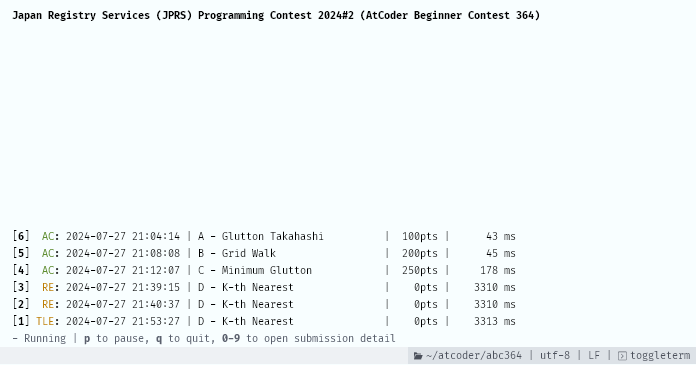

# atcoder-judge-monitor / Monitor for your AtCoder submissions

**English** | [日本語](./README.ja.md)

  
This is a simple monitor for your AtCoder submissions. It shows the status of your submissions in real time.
You can submit your code and check the result without using a web browser by combining it with [`oj s main.rb`](https://github.com/online-judge-tools/oj).

## Usage

```
cargo install --git https://github.com/sevenc-nanashi/atcoder-judge-monitor.git

atcoder-judge-monitor login

atcoder-judge-monitor monitor
```

## License

This application is released under the MIT License, see LICENSE.
